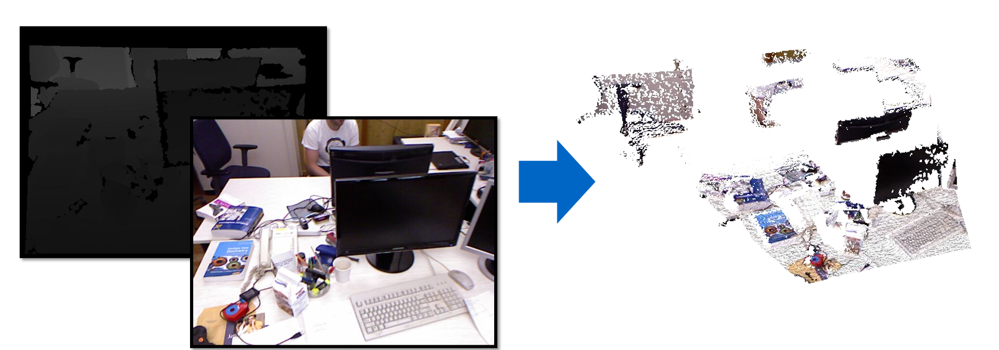

# Development Environment

Docker image with all the required dependencies for the lecture https://niessner.github.io/3DScanning/


## Install Docker (and `docker-compose` or `docker compose`)

The first step is installing docker: https://docs.docker.com/engine/install/

## Build the development image

The following command will take some time. It will create a Docker image and install and compile the required dependencies.

```bash
docker build . -t 3dsmc
```

## Start the development environment

```bash
docker-compose up

# Or
# docker compose up
```

### Access the environment

In the web browser open the following link: http://localhost:8443/

Alternatively, you can access the CLI of the environment by executing: `docker exec -it 3dsmc /bin/bash`

### Directories

The directory `app` stores the Docker container files. (nothing should be done there).

The directory `files` is shared with the container (VSCode). You will need to place there the exercises from Moodle.


# Concepts

## Back-Projection Task (TUM RGB-D SLAM Dataset) - Source Code under `app/back_projection`

### Steps

1. We Load calibrated camera intrinsics `K`, extrinsics `T_cw`, and RGB-D frames.

2. For each pixel `(u, v)` with depth `d`:
    - Compute camera-space point:  
      `p_cam = d * K⁻¹ * [u, v, 1]^T`
    - Transform to world coordinates:  
      `p_world = R * p_cam + t`, where `T_cw = [R | t]`
    - Assign RGB color from the aligned color image at `(u, v)`.

3. We Use the 2D pixel grid structure to define mesh faces by connecting adjacent pixels into triangles.

4. Finally, we write vertices and faces with color to an OFF file.

Result: 




## Surface Representations - Source Code under `app/surface_representation`

### Steps

WIP

## Optimization - Source Code under `app/ceres-solver-optimization`

### Steps

WIP

## Coarse Alignment (Procrustes) - Source Code under `app/coarse_alignment-procrustes`

### Steps

WIP

## Object Alignment - Source Code under `app/icp-mesh-alignment`

### Steps

WIP